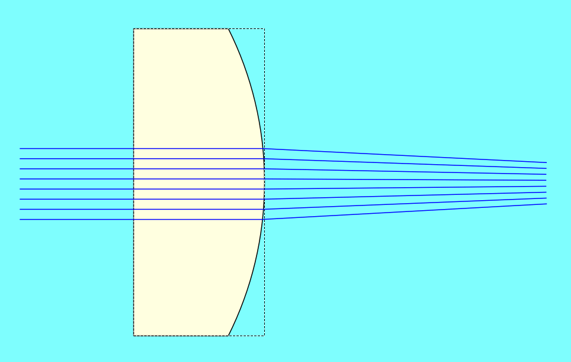

# opl-tilt
A quick, hacky visualization of equal-OPL wavefront tilt with [GeOptics](https://github.com/ederag/geoptics)

### Installing GeOptics

```bash
git clone https://github.com/ederag/geoptics
cd geoptics
python setup.py install
```

### In a nutshell

The `RayOPL` class is a subclass `geoptics.elements.rays.Ray` that defines a fixed optical path length (OPL). When rays are drawn, the length of the 'infinite' portions is constrained to this length. In this way, the orientation of the wavefront of equal OPL is visualized.

To get these rays to draw correctly, we also need to replicate their graphical counterparts (`QtRayOPL` and `_GQtRayOPL`, equivalent to `geoptics.guis.qt.rays.Ray` and `geoptics.guis.qt.rays._GRay` respectively). `RayOPL` instances are created by  `BeamOPL`, a subclass of `geoptics.elements.sources.Beam` which uses `RayOPL` instead of `geoptics.elements.rays.Ray`. Initialization of this beam is handled by `BeamOPL`'s graphical counterpart `QtBeamOPL`.

### Why?

To show how the transverse position of one of the objective lenses in a Linnik interferometer affects the effective tilt of the recorded interference signal. 

Because of this, the XY position of the sample objective can be used to compensate for the relative tilt of the reference reflector and the sample. In this way, the tilt of the interference signal can be finely adjusted without affecting the axial position of the coherence gate or the focus of the reference arm.


### Caveats

This hasn't been tested basically at all, but may be useful as an example of 'bending' GeOptics internals without modifying the source code itself.
I based my approach on a quick reading of GeOptics, so it may be inefficient and relatively stupid.
